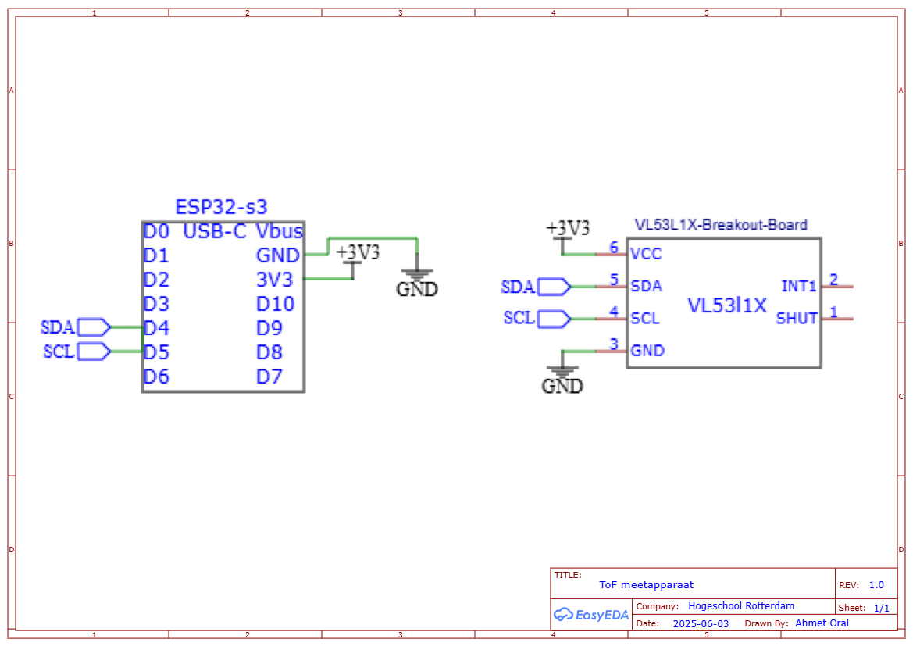

# ESP32-C6 VL53L1X BLE Distance Sensor

This project uses a VL53L1X Time-of-Flight (ToF) sensor and a XIAO ESP32-C6 microcontroller to perform distance measurements on demand via Bluetooth Low Energy (BLE). A Flutter app sends a `start` command, prompting the ESP32 to measure the distance, calculate the average, and send the result back via BLE notify.

## 🧰 Requirements

### Hardware
- XIAO ESP32-C6 microcontroller
- VL53L1X Time-of-Flight sensor
- USB-C cable (for programming and powering the ESP32)

### Software
- Arduino IDE (version 2.0 or later recommended)
- Flutter app (see MeasureApp)
- BLE libraries for Flutter (e.g., `flutter_bluetooth_serial` or `flutter_reactive_ble`, see MeasureApp)

## 🔌 Hardware Connections

Connect the VL53L1X sensor to the XIAO ESP32-C6 as shown in the schematic below:

| VL53L1X Pin | ESP32-C6 Pin  |
|-------------|---------------|
| VCC         | 3.3V          |
| GND         | GND           |
| SDA         | D4 (GPIO6)    |
| SCL         | D5 (GPIO7)    |

## 📦 Arduino Setup

1. **Install Required Libraries**:
   - Open the Arduino IDE.
   - Go to **Sketch > Include Library > Manage Libraries**.
   - Search for `VL53L1X` by Pololu and install it.

2. **Add ESP32 Board Support**:
   - Open **Tools > Board > Boards Manager**.
   - Search for `esp32` and install the `esp32` package by Espressif.
   - Select **XIAO_ESP32C6** under **Tools > Board > ESP32 Arduino**.

3. **Upload the Code**:
   - Connect the XIAO ESP32-C6 to your computer via the USB-C cable.
   - Open the project code in the Arduino IDE.
   - Click **Upload** to flash the code to the ESP32.

## 🧪 How It Works

### 🔄 BLE Communication

The ESP32 sets up a BLE server with the following configuration:

| BLE Element           | UUID                                     | Properties       |
|-----------------------|------------------------------------------|------------------|
| Service               | `12345678-1234-5678-1234-56789abcdef0`  | -                |
| Notify Characteristic | `12345678-1234-5678-1234-56789abcdef1`  | Read / Notify    |
| Write Characteristic  | `12345678-1234-5678-1234-56789abcdef2`  | Write            |

### 🧾 Workflow

1. The ESP32 starts a BLE server and waits for a connection.
2. Use your Flutter app (or a BLE debugging tool like nRF Connect) to connect to the ESP32.
3. The app sends the string `"start"` to the **write characteristic**.
4. The ESP32 performs 20 distance measurements using the VL53L1X sensor, calculates the average, and sends the result back via the **notify characteristic**.