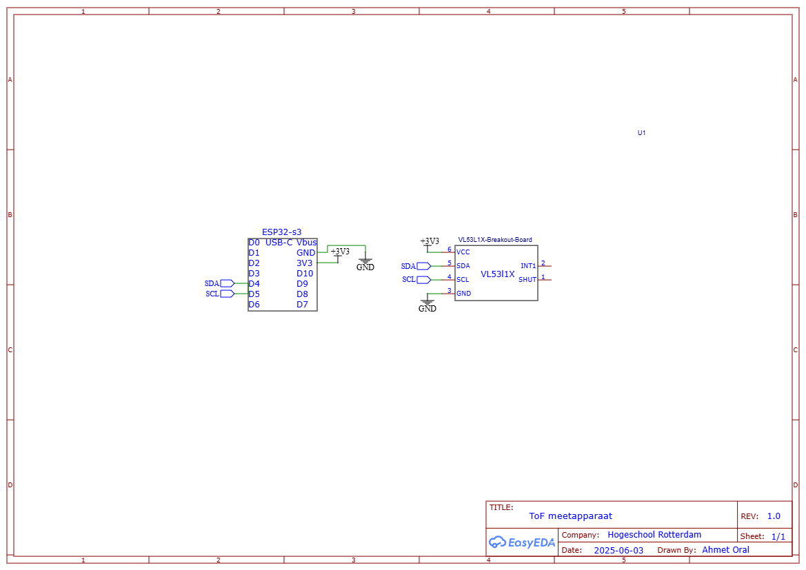

# ESP32-C6 VL53L1X BLE Afstandssensor

Dit project maakt gebruik van een VL53L1X Time-of-Flight sensor en een XIAO ESP32-C6 om op aanvraag via Bluetooth Low Energy (BLE) een afstandsmeting uit te voeren. Een Flutter-app stuurt een `start`-commando, waarna de ESP32 de afstand meet en het gemiddelde terugstuurt via BLE notify.

## 🧰 Benodigdheden

- XIAO ESP32-C6
- VL53L1X sensor
- Arduino IDE
- USB-C kabel
- Flutter-app om BLE aan te sturen

---

## 🔌 Hardware Aansluitingen

Sluit de VL53L1X sensor aan op de XIAO ESP32-C6 **zoals weergegeven in onderstaand elektrisch schema**:

| VL53L1X Pin | ESP32-C6 Pin |
|-------------|--------------|
| VIN         | 3.3V         |
| GND         | GND          |
| SDA         | D4 (GPIO6)   |
| SCL         | D5 (GPIO7)   |

> 📌 Let op: Sommige VL53L1X-modules hebben ingebouwde pull-up weerstanden. Zo niet, plaats dan 4.7kΩ pull-ups tussen SDA/SCL en 3.3V.

---

## 📦 Arduino Setup

1. **Installeer de benodigde libraries** via de Arduino Library Manager:
   - `VL53L1X` door Pololu

2. **Installeer ESP32-board ondersteuning**:
   - Ga naar **Boards Manager**, zoek op `"esp32"` en installeer het pakket van **Espressif**.
   - Kies **XIAO_ESP32C6** als board.

3. **Upload de code** naar de ESP32.

---

## 🧪 Werking

### 🔄 BLE-communicatie

| BLE Element           | UUID                                     | Eigenschap |
|-----------------------|-------------------------------------------|------------|
| Service               | `12345678-1234-5678-1234-56789abcdef0`     |            |
| Notify Characteristic | `12345678-1234-5678-1234-56789abcdef1`     | Lezen / Notify |
| Write Characteristic  | `12345678-1234-5678-1234-56789abcdef2`     | Schrijven  |

### 🧾 Workflow

1. De ESP32 start een BLE-server en wacht op verbinding.
2. Je Flutter-app (of een BLE tool zoals nRF Connect) verbindt met het apparaat.
3. App stuurt `"start"` (als string) naar de **write characteristic**.
4. De ESP32 voert 20 metingen uit, berekent het gemiddelde, en stuurt dit terug via **notify**.

---
